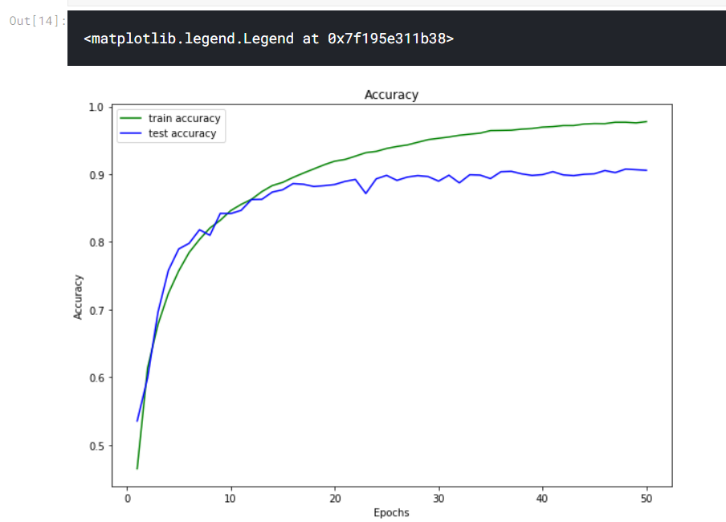
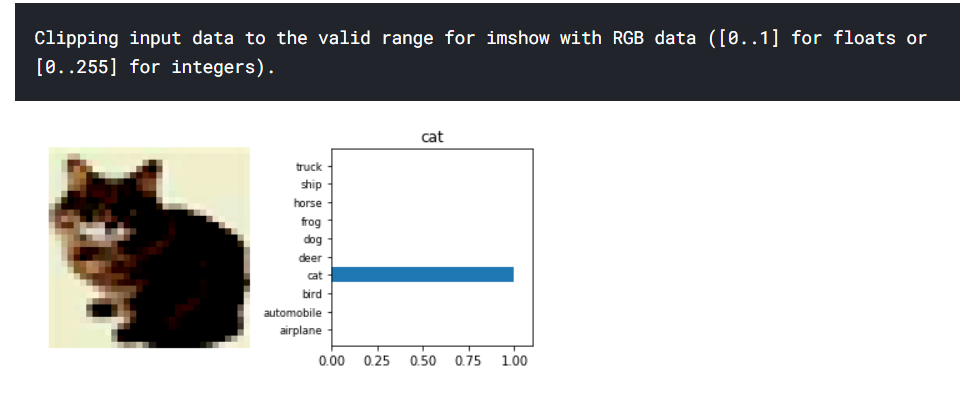

# Classifying-CIFAR-10-Images-with-DenseNet-121
An image classificaion model using deep learning over the the CIFAR-10 dataset with DenseNet-121 architecture.  

The dataset ca be found here :  
https://www.kaggle.com/pankrzysiu/cifar10-python   

DenseNet architecture explicitly differentiates between information that is added to the network and information that is preserved. DenseNet layers are very narrow (e.g., 12 filters per layer), adding only a small set of feature-maps to the “collective knowledge” of the network and keep the remaining featuremaps unchanged—and the final classifier makes a decision based on all feature-maps in the network. Besides better parameter efficiency, one big advantage of DenseNets is their improved flow of information and gradients throughout the network, which makes them easy to train. Each layer has direct access to the gradients from the loss function and the original input signal, leading to an implicit deep supervision . This helps training of deeper network architectures. Further, we also observe that dense connections have a regularizing effect, which reduces overfitting on tasks with smaller training set sizes.  

Instead of drawing representational power from extremely deep or wide architectures, DenseNets exploit the potential of the network through feature reuse, yielding condensed models that are easy to train and highly parameterefficient. Concatenating feature-maps learned by different layers increases variation in the input of subsequent layers and improves efficiency. This constitutes a major difference between DenseNets and ResNets. Compared to Inception networks, which also concatenate features from different layers, DenseNets are simpler and more efficient.   

The output looks like :   

